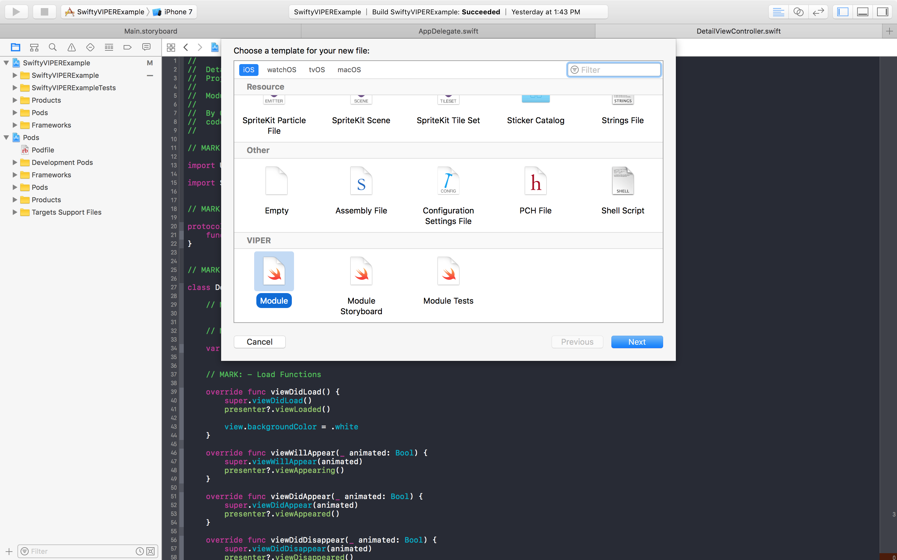
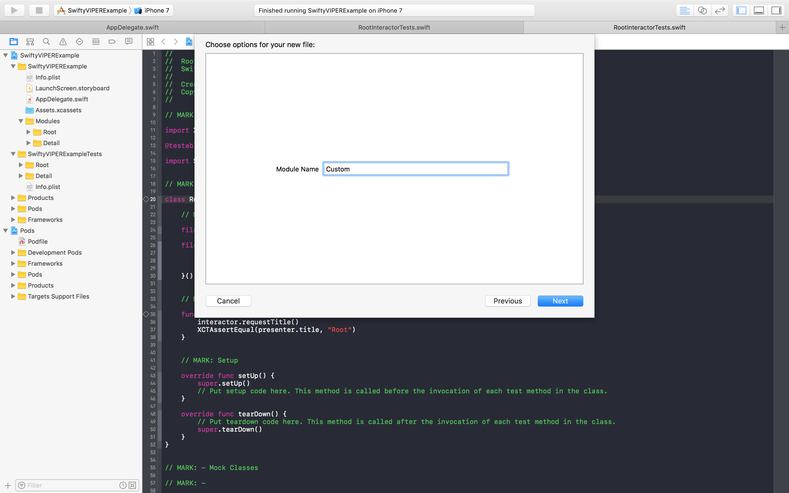

![Header][header-image]

---

[![Swift Version][swift-image]][swift-url]
[![License][license-image]][license-url]
[![Build Status][build-image]][build-url]
[![Code Coverage][codecov-image]][codecov-url]
[![CocoaPods Version][cocoapod-v-image]][cocoapod-url]
[![CocoaPods Platform][cocoapod-p-image]][cocoapod-url]

SwiftyVIPER allows easy use of VIPER architecture thoughout your iOS application.

### What is VIPER?

Great question! VIPER is a [backronym](https://en.wikipedia.org/wiki/Backronym) which stands for:

 - View
 - Interactor
 - Presenter
 - Entity
 - Router

If all of this is totally knew for you, check out my running list of [VIPER Resources](#resources)

## Features

- [x] VIPER Module Templates
- [x] VIPER Unit Test Templates
- [x] Simple Module Initialization and Presentation
- [x] Cocoapods Support
- [ ] Carthage Support

## Requirements

- iOS 8.0+
- Xcode 8

## Installation

#### CocoaPods
You can use [CocoaPods](http://cocoapods.org/) to install `SwiftyVIPER` by adding it to your `Podfile`:

```ruby
platform :ios, '8.0'
use_frameworks!
pod 'SwiftyVIPER'
```

To get the full benefits import `SwiftyVIPER` wherever you import UIKit

``` swift
import UIKit
import SwiftyVIPER
```

#### Manually

This is discouraged, but allowed. :D

1. Download and drop the ```Source``` folder in your project.
2. Congratulations!

#### Carthage (Coming Soon)

---

## Usage of SwiftyVIPER

### Installing Templates

If you're looking for VIPER architecture templates to use directly within Xcode, you can find these in the `/Templates/VIPER` folder. Open your terminal and run:

```bash
cd PATH/TO/REPO
```

Then, simply run this command in your terminal:

```bash
mkdir -p ~/Library/Developer/Xcode/Templates/File\ Templates
cp -R Templates/VIPER ~/Library/Developer/Xcode/Templates/File\ Templates
```

### Adding a Module

Once you've installed the VIPER Templates, you're ready to add a module. Select `File > New > File` or use press `⌘N` to bring up the template selector. You'll find the templates at the bottom.

Choose `Module` for a normal module, `Module Storyboard` for a normal module that interacts with Storyboards, or `Module Tests` for a module unit tests template.



Next, choose the Module name. We'll go with `Custom`.



This will create 5 files per module:

- `CustomModule.swift`
- `CustomViewController.swift`
- `CustomPresenter.swift`
- `CustomRouter.swift`
- `CustomInteractor.swift`

Don't forget to target your main app. Once you've added the main template, go ahead and add the Unit Test template. **Make sure it's the same name!** In this case, we'd stay with `Custom`.

### Using SwiftyVIPER

Simply add a new module using the VIPER template. Once done, simply call:

```swift
import SwiftyVIPER

CustomModule().present(from: self.viewController, style: .coverVertical, completion: nil)
```

The module will handle the rest, including initializing and attaching all the connections necessary for the Module to show properly.

## Contribute

We would love for you to contribute to **SwiftyVIPER**, check the ``LICENSE`` file for more info. Pull Requests welcome!

## Resources

 - [mutualmobile.com](https://mutualmobile.com/posts/meet-viper-fast-agile-non-lethal-ios-architecture-framework)
 - [objc.io](https://www.objc.io/issues/13-architecture/viper/)
 - [ckl.io](https://www.ckl.io/blog/ios-project-architecture-using-viper/)
 - [stackoverflow.com](http://stackoverflow.com/questions/35132664/why-protocols-are-used-in-both-direction-in-viper-architecture-rather-than-in-on)
 - [yalantis.com](https://yalantis.com/blog/tree-of-models-as-an-alternative-app-architecture-model/)
 - [medium.com](https://medium.com/mobile-travel-technologies/architecting-mobile-apps-with-b-viper-modules-e94e277c8d68)
 - [speakerdeck.com](https://speakerdeck.com/sergigracia/clean-architecture-viper)
 - [brigade.engineering](https://brigade.engineering/brigades-experience-using-an-mvc-alternative-36ef1601a41f#.tezoetq87)

## Meta

- Cody Winton – [@codytwinton](https://twitter.com/codytwinton)
- Distributed under the MIT license. See [LICENSE][license-url] for more information.
- Inspired by [ViperMcFlurry](https://github.com/rambler-digital-solutions/ViperMcFlurry)
- README edited with [StackEdit](https://stackedit.io/)


[header-image]: Assets/SwiftyVIPER.png

[build-image]: https://travis-ci.org/codytwinton/SwiftyVIPER.svg?branch=master
[build-url]: https://travis-ci.org/codytwinton/SwiftyVIPER

[swift-image]: https://img.shields.io/badge/swift-3.0-orange.svg
[swift-url]: https://swift.org/

[license-image]: https://img.shields.io/github/license/codytwinton/SwiftyVIPER.svg
[license-url]: LICENSE

[codecov-image]: https://codecov.io/gh/codytwinton/SwiftyVIPER/branch/master/graph/badge.svg
[codecov-url]: https://codecov.io/gh/codytwinton/SwiftyVIPER

[cocoapod-url]: http://cocoapods.org/pods/SwiftyVIPER
[cocoapod-v-image]: https://img.shields.io/cocoapods/v/SwiftyVIPER.svg
[cocoapod-p-image]: https://img.shields.io/cocoapods/p/SwiftyVIPER.svg

[codebeat-image]: https://codebeat.co/badges/c19b47ea-2f9d-45df-8458-b2d952fe9dad
[codebeat-url]: https://codebeat.co/projects/github-com-vsouza-awesomeios-com
